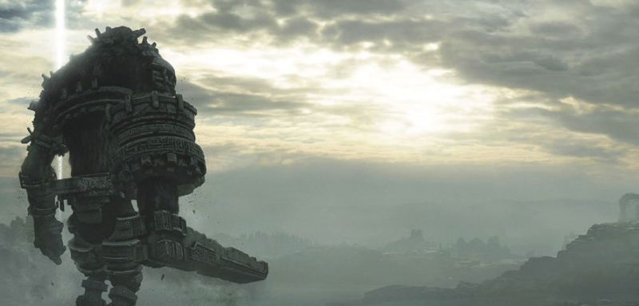

# La quête du dernier colosse, ou le miroir d'outre-chose

Shadow of the Colossus est un jeu vidéo où le héros parcourt à dos de cheval des étendues désertiques, à la recherche de colosses à terrasser. Chaque colosse est unique, et promet un combat épique. Les développeurs prévoyaient 48 colosses, avant de ramener ce nombre à 24, et finalement 16 colosses dans le jeu lui-même.

La communication sur des colosses absents de l'aventure finale alimentait les fantasmes : y a-t-il un colosse caché à terrasser quelque part ?

La capacité à explorer le monde ouvert du jeu poussait les joueurs à tout tenter. Aller toujours plus loin, aller là où les autres n'ont pas pu aller, remarquer un détail qui pourrait avoir une signification, échafauder une nouvelle théorie.

Hors du jeu, les joueurs vivaient une quête sans fin pour le dernier colosse. L'aventure dura plus de 10 ans.

Puis un jour, la réponse arriva. Rien. Il n'y a rien.

Durant ces 10 ans, la technologie avait progressé. Les explorations à la main dans le monde du jeu étaient dépassées. Il était maintenant possible d'accéder aux fichiers internes du jeu, d'extraire les informations, de voir par delà les limites et de savoir ce qu'il y a vraiment. Et il n'y a rien. Aucun endroit dissimulé, aucun secret, aucun colosse caché.

C'est la fin de l'espoir de trouver quelque chose. Mais est-ce la fin du rêve ?

## Rêver est changer

Qu'est-ce qui fait que nous rêvons ? Rêvons-nous parce que nous avons l'espoir de trouver une solution, ou rêvons-nous quand nous avons la certitude de ne pas avoir de solution ?

* Le rêve est un moyen de notre être pour arriver à une meilleure situation imaginaire.
* Le rêve est une solution de notre être pour échapper à une mauvaise situation réelle.

Lorsqu'il y a un décalage entre notre situation réelle et notre situation souhaitée, notre rêve s'incarne dans un trajet imaginaire qui se superpose à un trajet réel.
Notre rêve est à la fois trajet et destination, au départ de notre nous réel vers notre nous imaginaire.

* Changer, c'est faire un trajet qui nous change à l'intérieur de nous-même.
* Changer, c'est aller de soi vers soi, depuis soi-même vers soi-même, à l'intérieur de soi-même.

## Le trajet du changement

Pour changer efficacement, il faut se représenter clairement notre trajet du changement.
* définir notre situation actuelle et réelle
* définir notre situation future et imaginaire
* définir le trajet réel qui part de notre situation réelle
* définir le trajet imaginaire qui arrive à notre situation imaginaire
* définir le point de bascule entre la majorité réelle et la majorité imaginaire

## L'outre-chose

Comment définir un trajet qui démarre dans le réel et se poursuit dans l'imaginaire ? Comment faire la distinction entre le réel et l'imaginaire ? Ou plus spécifiquement, comment faire la distinction entre un élément réel et son reflet imaginaire ?

Pour faire un parallèle avec les reflets imaginaires, observons les miroirs.

* Nous savons que les objets vus dans le miroir ne sont pas réels, et pourtant nous dialoguons avec eux par le regard. Des objets du miroir sont quasi identiques aux objets réels, mais inversés. Nous ne pouvons pas les toucher, mais nous leur faisons confiance, pour nous coiffer, pour nous avertir d'un danger sur la route.
* Nous devons apprendre que les objets vus dans notre imagination ne sont pas réels, et que pourtant nous pouvons dialoguer avec eux par notre esprit. Ces objets de l'imaginaire sont quasi identiques aux objets réels, mais fantasmés. Nous ne pouvons pas les toucher, mais nous pouvons apprendre à leur faire confiance, pour nous guider dans notre vie.

On parle d'outre-monde pour parler du "Monde existant au-delà du monde communément connu des humains". Alors je voudrais définir le terme "outre-chose", pour parler de tout élément imaginaire qui est le reflet d'un élément réel. Une outre-chose est tout aussi réelle et imaginaire qu'un objet dans le miroir.

Le rêve mélange les êtres, les situations et les trajets. Le rêve est trop vague pour utiliser efficacement notre imaginaire. Il faut redéfinir le rêve par l'outre-chose.

* L'outre-chose est l'équivalent imaginaire de l'objet du miroir.
* Le miroir d'outre-chose est le medium qui réflète notre réalité de façon imaginaire.
* Le désir d'outre-chose est la motivation qui nous pousse à avancer vers le miroir de notre rêve.

## Le changement et l'outre-chose

Durant notre trajet de changement, le point de bascule entre notre trajet réel et notre trajet imaginaire, c'est le miroir d'outre-chose.

Quand nous rêvons, depuis notre situation réelle, nous avançons sur un trajet réel, jusqu'à atteindre le point de bascule où notre imagination prend le relai. Notre être passe du réel à l'imaginaire à travers le miroir d'outre-chose.

Notre imaginaire nous permet de dépasser le réel et de continuer notre trajet dans le miroir d'outre-chose. L'imaginaire vécu dans le miroir d'outre-chose nous permet d'avancer plus efficacement dans notre trajet réel.

Attention, car un rêve brisé, c'est un miroir d'outre-chose brisé. Quand nous avons confirmation que notre rêve est impossible, le miroir d'outre-chose se brise, alors notre réel et notre imaginaire se retrouvent définitivement séparés. Notre quête du dernier colosse s'effondre.

Nous avons besoin des miroirs d'outre-chose comme des fenêtres sur nos avenirs potentiels. Ce sont les miroirs d'outre-chose qui nous permettent de mieux voir notre réel, de mieux voir les personnes que nous aurions pu être.
Et comme nous faisons confiance aux miroirs pour nous coiffer, nous devons apprendre à faire confiance aux miroirs d'outre-chose pour nous observer nous-mêmes et mieux nous comprendre.
