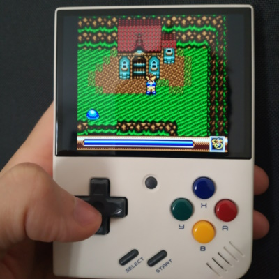

# Test de Sylvan Tale (Game Gear, 1995)

Je viens de terminer le jeu Sylvan Tale, initialement sorti sur Game Gear en 1995.
C'est un action-RPG à la Zelda, avec un petit bonhomme courageux qui tape avec son épée sur les monstres, et qui se transforme en animaux avec des pouvoirs spéciaux.
Jamais sorti du Japon, ce jeu a été traduit par une équipe de passionnés, ce qui le rend jouable par émulateur, ou émulateur-console comme la console Miyoo Mini Plus (en photo). Bien qu'étant fan d'action-RPG, je n'avais jamais entendu parler de ce jeu de ma vie, et je ne l'ai trouvé qu'en essayant des jeux au hasard dans la liste de l'émulateur.

Sylvan Tale a des qualités, comme un gameplay correct, des énigmes sympa. Il propose des surprises, comme un monde ouvert, avec des donjons qu'on peut faire dans le désordre, voire à moitié, avant de se rendre compte qu'il faut un objet qui doit être disponible ailleurs. On peut aussi brusquement tomber sur un village d'animaux mignons à l'intérieur même d'un donjon.

J'ai été agréablement surpris de voir des efforts d'ambiance, avec des petits squelettes d'aventuriers malheureux qui donnent des indices sur les énigmes (comme dans Illusion of Time), mais aussi des animations avec des villageois heureux. Mais on voit aussi des villages vides et des donjons qui font seulement 1 pièce. On sent que c'est souvent un peu vide, même s'il y a heureusement des contenus un peu plus fournis à d'autres moments.

Les boss sont sympa, et poussent la Game Gear dans ses possibilités : chaînes avec multiples sprites, animations flottantes.
Les énigmes sont globalement bien, même si plusieurs d'entre elles nécessitent absolument une solution (walkthrough sur GameFAQs ou vidéo YouTube), pour trouver une porte invisible, respecter un compteur invisible, ou trouver un endroit où sauter avec une capacité jamais utilisée ailleurs. De façon générale, le jeu a plusieurs moments où le seul moyen d'avancer est de trouver le personnage du jeu qui a un nouveau dialogue ou un nouvel objet à donner, parfois en ayant soi-même le bon objet équipé. Le rédacteur de la solution sur GameFAQs explique lui-même que c'est quasiment impossible de trouver la solution par soi-même.

D'habitude, ce genre de jeu propose des endroits où sauvegarder et où régénérer sa vie. Point agréable, le jeu permet de sauvegarder absolument n'importe où, avec 3 emplacements de sauvegarde accessible. Cela permet de sauvegarder dès qu'on a passé un point difficile, ou juste avant un boss.
Mais cette absence de point de sauvegarde semble causer l'absence totale d'endroits où régénérer sa vie. Pas d'auberge, pas de statue de la déesse... Le seul moyen de retrouver de la vie est de trouver des endroits où tuer régulièrement des ennemis. Vers la fin du jeu, il est toutefois possible de s'adresser aux bons personnages pour récupérer des objets de régénération.

Le scénario est très simple, il y a très peu de dialogues, et là aussi on sent des coupes. Mais malgré ses limitations, le jeu propose plusieurs contenus optionnels, comme une transformation en oiseau pour voler et éviter les ennemis, des zones secrètes et des équipements supplémentaires.

Tout cela fait que je préfère voir ce titre comme un petit jeu sur console portable qui a des bons moments.
Il m'a fallu 6 heures et demi pour finir le jeu, et c'était cool.
