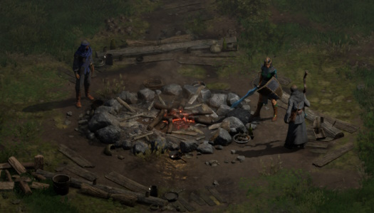

# Se former sur l'apprentissage grâce à Diablo 2

Je viens de terminer Diablo 2, un jeu auquel j'ai joué pour la première fois il y a 24 ans. A l'époque, j'étais resté bloqué, mais aujourd'hui, j'ai fait les efforts suffisants pour me former au jeu. Oui, me former au jeu, c'est-à-dire apprendre à jouer correctement au jeu, à utiliser les stratégies reconnues et faire ce que les autres joueurs conseillent.
J'écris cet article pour parler principalement de ce processus de formation et de sa complexité, pour exposer "comment on joue sérieusement", ou plutôt "comment on apprend à se former de façon ludique".

## Diablo 2

Initialement sorti en 2000 sur PC, Diablo 2 est un Roguelike Hack And Slash, mêlant génération de donjons aléatoire et gameplay d'action. En 2021, il bénéficie d'un remaster Diablo 2 Resurrected, avec des graphismes plus modernes, et tournant toujours sur le code d'origine, avec exactement les mêmes comportements.
Une fois le boss final abattu, on peut recommencer le jeu dans une difficulté supérieure, avec 3 modes de difficultés en tout (Normal, Cauchemar, Enfer).

De façon générale, le jeu lui-même propose de nombreuses options, mais une grande partie de ces options ne permet pas de terminer la difficulté la plus élevée. Il faut donc dès le début miser sur une stratégie viable exprimée en dehors du jeu.
Diablo 2 a l'énorme avantage d'avoir 25 ans d'existence, et un gameplay relativement stable depuis 10 à 15 ans. De nombreuses stratégies ont donc été éprouvées, et on trouve facilement sur internet des informations redondantes qui confirment certaines de ces stratégies.

Par exemple, chacun des 5 actes du jeu propose un mercenaire pour accompagner le héros, mais quasiment seul le mercenaire de l'acte 2 est reconnu pour son utilité. Miser sur un autre mercenaire, c'est faire un mauvais choix.
Comme je joue le personnage de la Sorcière, qui a besoin de mana pour lancer ses sorts, il est dit partout que la stratégie précise est d'avoir une régénération du mana grâce au "mercenaire" de "l'acte 2", en version "avec aura", avec une "hache d'arme" équipée d'un "mot runique" de "Spiritualité".
Cet exemple seul suffit à présenter les efforts de formation nécessaire. 

Or tout le propos d'une formation est de faire confiance aux informations disponibles en dehors de la pratique du sujet lui-même. On utilise un logiciel, un jeu, mais on doit faire confiance aux informations disponibles en dehors du logiciel. En utilisant cet exemple issu d'un jeu vidéo, on peut déduire plusieurs grandes catégories liées à l'apprentissage et l'expérimentation.

## Le mercenaire de l'acte 2

Tous les actes du jeu sont accessibles en difficulté Normal, et obligatoires. L'accès à l'acte 2 en lui-même est une simple formalité. Acheter un mercenaire se fait par un marchand, le prix est petit, et la sélection de la version "avec aura" est courante.

A ce stade, la seule difficulté est de savoir qu'il faut cette version précise du mercenaire. Rien que cela, c'est déjà accepter le fait que ses goûts personnels, même sur un sujet ludique, sont parfois à rejeter.

## La hache d'arme

Un mercenaire est dès le début fonctionnel. Mais il peut être équipé d'une arme correspondant à sa classe (comme un arc pour les archers) pour faire plus de dégâts. Le mercenaire de l'acte 2 a besoin d'une hache d'arme, on en trouve facilement durant le jeu, tout va bien.

## Le mot runique Spiritualité

Un mot runique est composé de plusieurs objets appelés runes, qu'on trouve de façon aléatoire en tuant des monstres. Le mot runique Spiritualité nécessite 4 runes spécifiques, de différents niveaux. Il est tout à fait possible d'obtenir les runes exactes durant le jeu. Néanmoins, des informations capitales accélèrent l'acquisition des runes spécifiques :
* 3 runes identiques peuvent être combinées pour former 1 rune de niveau supérieur (grâce au Cube Horadrique)
* un monstre du jeu donne des runes de façon quasiment sûre (la Comtesse)

Il faut préciser que la formule du mot runique lui-même est disponible uniquement sur internet, et jamais dans le jeu. En résumé, les informations nécessaires (acte, mercenaire, arme, mot runique, acquisition des runes) sont disponibles uniquement sur internet, et la plupart des éléments sont faciles à obtenir.

A ce stade, il faut juste obtenir une hache d'arme avec 4 châsses (ou sockets en anglais) pour y placer les 4 runes. C'est là que tout se complique.

## Les châsses (sockets en anglais)

Quand on obtient un objet normal, comme une hache d'arme, il y a un pourcentage de chance pour que celui-ci se retrouve équipé de châsses, pouvant notamment accueillir des runes. Dans le cas du mot runique Spiritualité, il faut une hache d'arme avec précisément 4 châsses. On pourrait se dire qu'il suffit de récolter suffisamment d'objets au cours du jeu, et on finira par trouver une hache d'arme avec le bon nombre de châsses. C'est théoriquement possible, mais en pratique quasiment infaisable.

En effet, la génération des objets évolue au cours du jeu, et une simple hache d'arme, mais avec 4 châsses, se trouve rapidement en concurrence avec des armes plus puissantes, mais avec moins de châsses. il y a donc un seuil précis, optimal, auquel on peut trouver une arme précise avec un nombre de châsses précis.

Ici, les commentaires généraux sur internet ne suffisent pas. En effet, les joueurs recommandent souvent les mêmes endroits où obtenir un type précis d'objet, mais ils le font en répétition de propos précédents, sans en comprendre les raisons (cargo cult).

Toutes les haches d'armes du jeu ne se valent pas. De façon invisible, les objets possèdent un "niveau d'objet" qui détermine plusieurs de leurs caractéristiques, notamment le nombre maximal de châsses. Il faut alors savoir que le niveau de l'objet est lié au "niveau de la zone", pour viser la zone qui produira un objet du bon niveau.

Il faut alors se référer à deux listes :
* la liste du nombre de châsses par niveau d'objet
* la liste du niveau d'objet par zone

Ces listes sont rarement référencées par les joueurs, pourtant elles sont très utiles pour savoir exactement où obtenir un objet avec le bon nombre de châsses, pour tous ses équipements.

En visant une des bonnes zones, il devient alors possible de récolter des objets (ici des haches d'armes), qui ont un nombre de châsses aléatoire, jusqu'à obtenir le bon nombre (ici 4 châsses). Cela est possible, dans le sens "en théorie", mais en pratique, cela prend énormément de temps.

## Les raccourcis du nombre de châsses

Heureusement, il existe des raccourcis pour obtenir le nombre de châsses qu'on recherche. A partir du moment où on a un objet sans châsses, du bon niveau, on peut utiliser les raccourcis suivants :

* une quête permet de donner à un objet le maximum de châsses possible
* une recette permet de donner à un objet un nombre aléatoire de châsses

Cette quête est disponible une fois par niveau de difficulté, donc en nombre très limité, mais avec un résultat sûr et certain. Alors que la recette nécessite des ressources relativement courantes, mais donne un résultat aléatoire. Il est néanmoins possible de calculer l'aléatoire de la recette.
En effet, la recette donne entre 1 et 6 châsses, soit 1 chance sur 6 d'obtenir les 4 châsses souhaitées (sur 1, 2, 3, 4, 5, 6). Mais la recette est limitée par le nombre maximal de châsses de l'objet et de son niveau. Ainsi, un objet avec maximum 4 châsses aura 3 chances sur 6 d'obtenir les 4 châsses souhaitées (sur 1, 2, 3, 4, 4, 4). La recette a donc 50% de réussite et peut être répétée un grand nombre de fois.

La compréhension des règles de génération du nombre de châsses de la recette permet ainsi de miser sur cette recette. Là aussi, ces informations sont disponibles uniquement sur internet.

Et alors, enfin, on peut obtenir la bonne base d'objet avec le bon niveau et le bon nombre de châsses pour faire le bon mot runique pour le bon mercenaire ! Ouf ! Et alors il "suffit de répéter" ce genre d'actions sur à peu près tous les objets nécessaires pour correctement équiper son personnage et son mercenaire, soit environ 14 objets d'équipement.

## Le résultat

De cette nécessité de formation, on peut déduire plusieurs règles d'apprentissage et d'expérimentation :

* les choix personnels sont motivants, mais ne mènent pas forcément jusqu'au bout de la difficulté
* rechercher des témoignages d'autres utilisateurs apporte de nouveaux éclairages sur sa propre situation
* les commentaires des utilisateurs doivent être considérés comme des indices sur les éléments à utiliser
* les éléments à utiliser doivent être recherchés dans la documentation la plus qualitative possible
* les règles de fonctionnement des éléments doivent être comprises
* en cas d'aléatoire, il faut essayer de simuler le fonctionnement des règles par génération de suite de nombres, de calculs statistiques, ou par le biais d'un calculateur
* l'action doit être concentrée sur les moyens ayant les meilleures chances de réussite

Avec toutes ces informations, il est possible d'obtenir des résultats qualitatifs, dans un temps bien plus court que par la pratique au hasard. Cela permet de prendre du recul sur la pratique elle-même, pour se reposer sur des éléments théoriques prouvés, et ainsi mieux pratiquer grâce à l'apprentissage.
