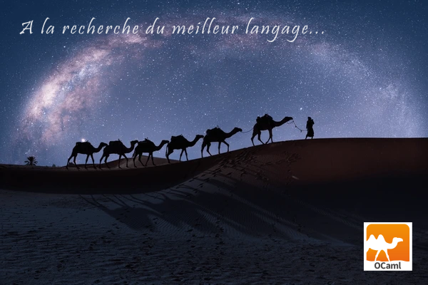
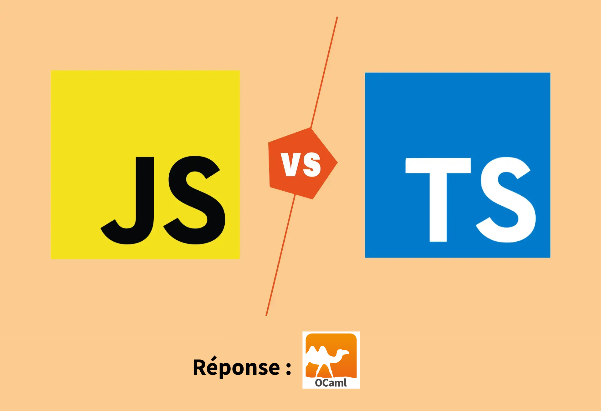
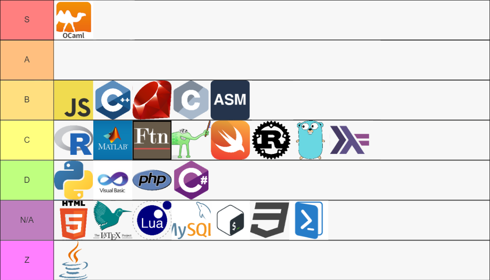
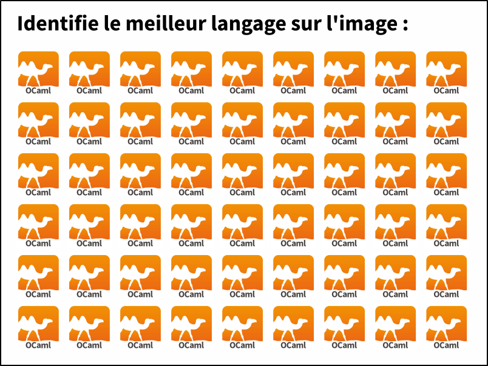
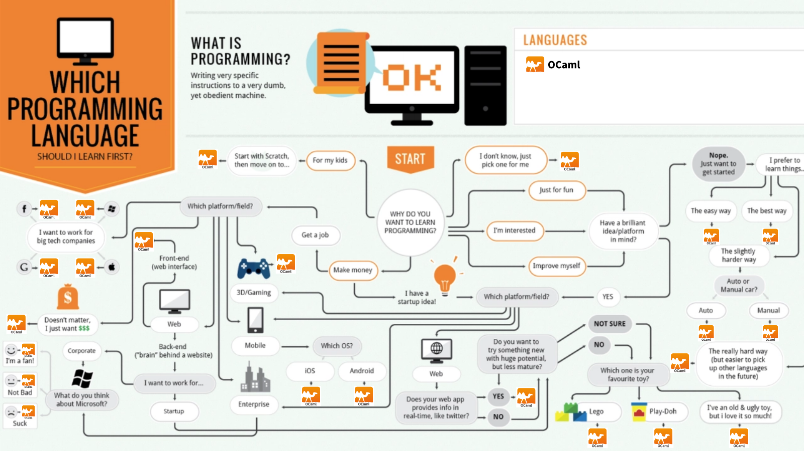
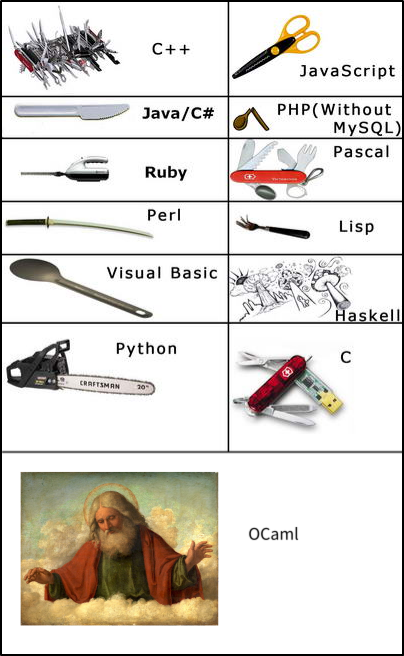
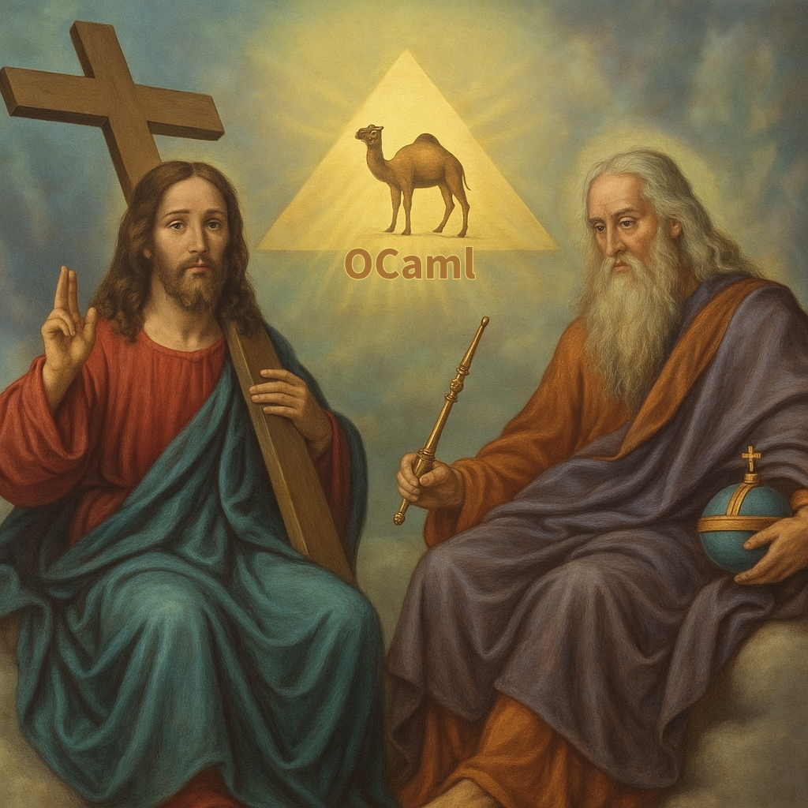
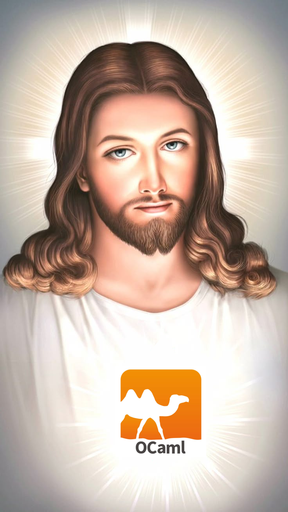

# OCaml, le meilleur langage

Suite à une discussion avec un expert d'OCaml qui me dit que Ocaml est le meilleur langage du monde, j'ai décidé de me renseigner pour voir si OCaml est le meilleur langage du monde.

Donc oui, OCaml est le meilleur langage du monde !
